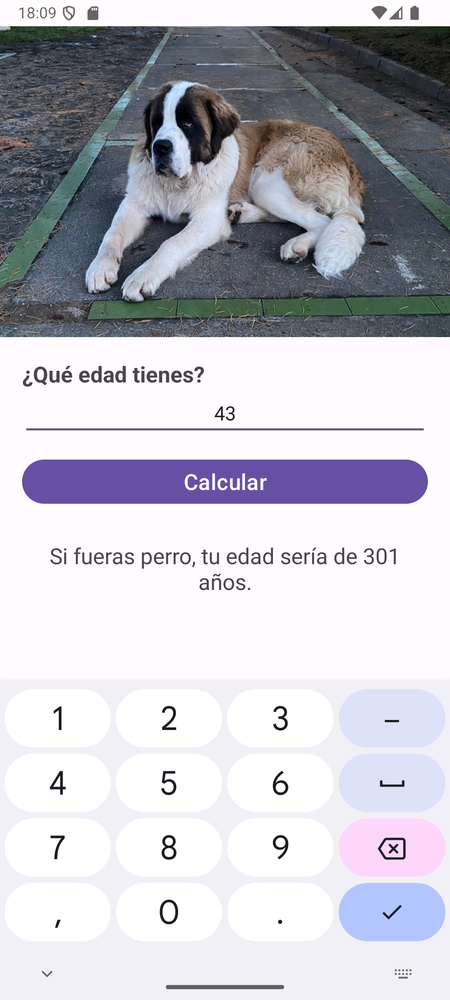

# Mi edad canina

### Aspecto Final de la App

### Con este ejercicio aprenderás los siguientes temas sobre Android:
- Android Views.
- ImageViews - Incluye imágenes en tus apps.
- Implementar views con findViewById en Kotlin.
- OnClickListener.
- Logcat.
- Logging con Android.
- Toasts.
- Recursos String.
- Como crear apps multi lenguajes.
- Data Binding.
- Como insertar y cambiar el ícono de la app.
- Qué es el Android Manifest.
- Tipos de Layouts.
