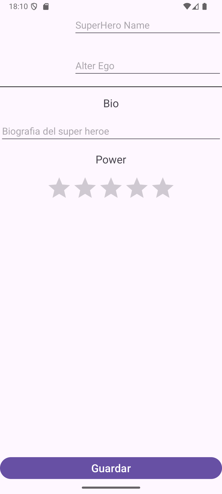

# Registro de Superhéroes

### Aspecto Final de la App

Esta es la segunda aplicación que vamos a desarrollar en clase

Con este ejercicio aprenderás los siguientes temas sobre Android:
- RelativeLayout.
- Explicit intents: Como abrir otras activities.
- Pasar datos entre activities.
- Parcelables: Pasar objetos entre activities.
- Implicit intents: Tomar fotos desde tus aplicaciones.
- Pasar fotos entre activities.
- ScrollViews.
- ConstraintLayout.
- Conocerás el archivo build.gradle.
