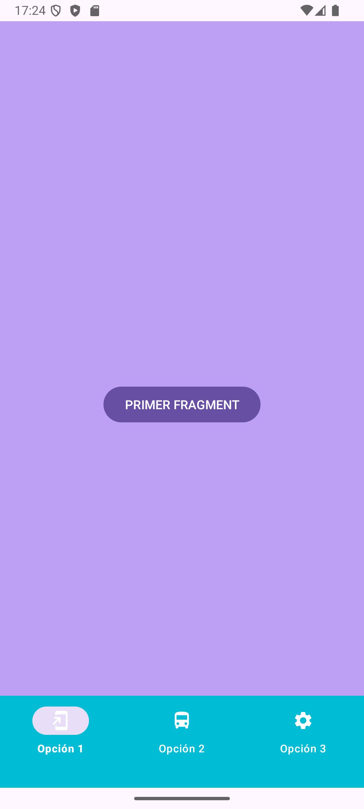
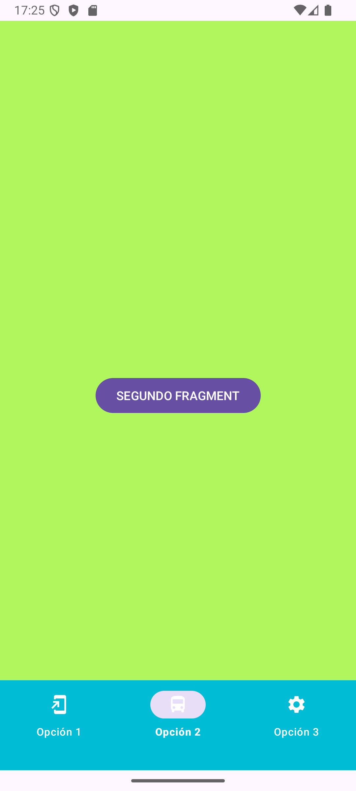
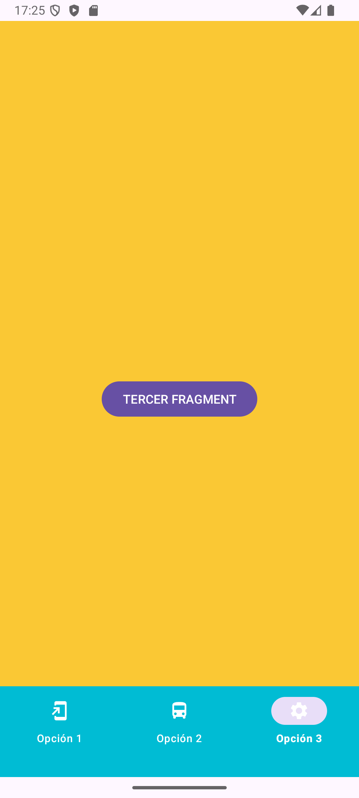

# App Fragmentos

### Aspecto Final de la App

 &nbsp;
&nbsp;

### Con este ejercicio aprenderás los siguientes temas sobre Android:

- [Fragmentos en Android](https://developer.android.com/guide/fragments?hl=es-419)
- Colocar Fragment mediante XML
- Colocar Fragment mediante código
- Pasar variables a los Fragments
- Crear un Menú inferior con BottomBarView